# Model Performance for Hate Speech Classification
In this project, we compare the performance of various classification models in their ability to detect hate speech. These include Logistic Regression (with L1, L2, and no penalty), KNN, RandomForest Classifier, XGBoost, and GaussianNB. Specifically, we train the models with a large dataset of phrases that are already classified as hate speech or not. We then test the models on a separate dataset of phrases to see how well they can identify hate speech. Broadly, we compare their detection abilities using a $all-MiniLM-L6-v2$ sentence transformer model and a $hateBERT$ sentence transformer model.

# Data Sources
Our training dataset was created by Vidgen et.al (2021), found [here](https://huggingface.co/datasets/tasksource/dynahate). This consists of over 41,000 comments that are defined as either "hate" or "not hate". The source for the test data comes from the ETHOS Hate Speech Dectection dataset, found [here](https://github.com/intelligence-csd-auth-gr/Ethos-Hate-Speech-Dataset/blob/master/ethos/ethos_data/Ethos_Dataset_Binary.csv). This dataset scrapes 998 comments from YouTube and Reddit and contains the likelihood of whether a comment is hate speech or not.

# Instructions for Reproducibility
To obtain the training data, download `hugging_face_data.py` file from the Hugging Face dataset, place into the code folder, and run the `csv_creator.py` file in the code folder. To obtain the test data,  run the `clean_data.py` code in the code folder to change the format and file name of the raw test data. To run the individual models, their respective codes can be ran in the code folder to obtain the necessary information on each model. This will also give their individual ROC curves, Precision-Recall curves, and confusion matrices. To get the comparative ROCs and Precision-Recall curves, we run `roc_curves.py`, `roc_curves_hatebert.py`, `pr_curves.py`, and `pr_curves_hatebert.py`.

# Models Used
## all-MiniLM-L6-v2

  

When looking at the ROC curves for the seven models using the $all-MiniLM-L6-v2$ sentence transformer, we see all the Logistic-based models have the best AUC with 0.79.

  

When looking at the Precision-Recall curves for the seven models using the $all-MiniLM-L6-v2$ sentence transformer, we see there is a four-way tie between the Logistic-based and the XGBoost models with an Average Precision of 0.78.

## hateBERT

  
    

When looking at the ROC curves for the seven models uisng the $hateBERT$ sentence transformers, we see all the Logistic-based models have the best AUC with 0.79, which is the same as the the previous transformer we saw.

  

When looking at the Precision-Recall curves for the seven models using the $hateBERT$ sentence transformer, the Logistic-based models do best  with an Average Precision of 0.78, which is the same as the the previous transformer we saw.

## Comparison of Confusion Matrices

  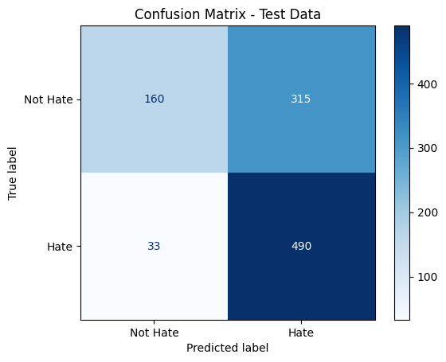
  

  <b>Left: Logistic with all-MiniLM-L6-v2 Sentence Transformers; Right: Logistic with hateBERT Sentence Transformers</b>

  
  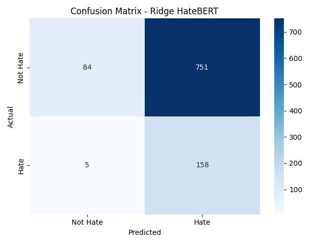

  <b>Left: Ridge with all-MiniLM-L6-v2 Sentence Transformers; Right: Ridge with hateBERT Sentence Transformers</b>

  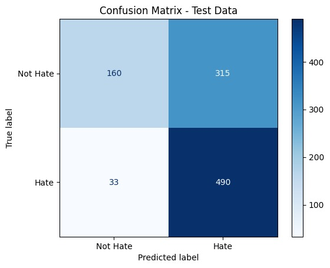
  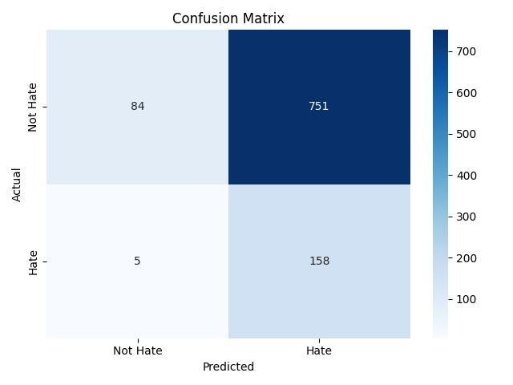

  <b>Left: Lasso with all-MiniLM-L6-v2 Sentence Transformers; Right: Lasso with hateBERT Sentence Transformers</b>

  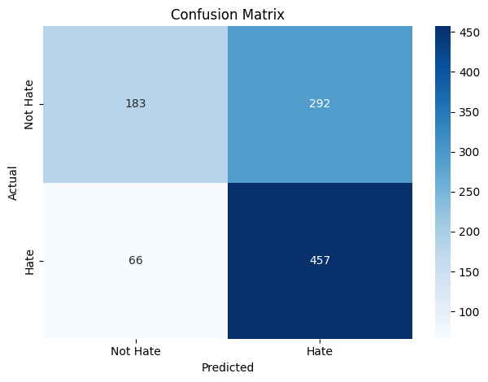
  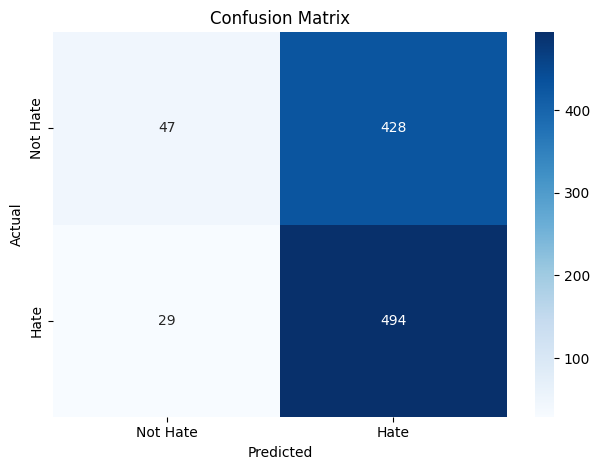

  <b>Left: KNN with all-MiniLM-L6-v2 Sentence Transformers; Right: KNN with hateBERT Sentence Transformers</b>

  
  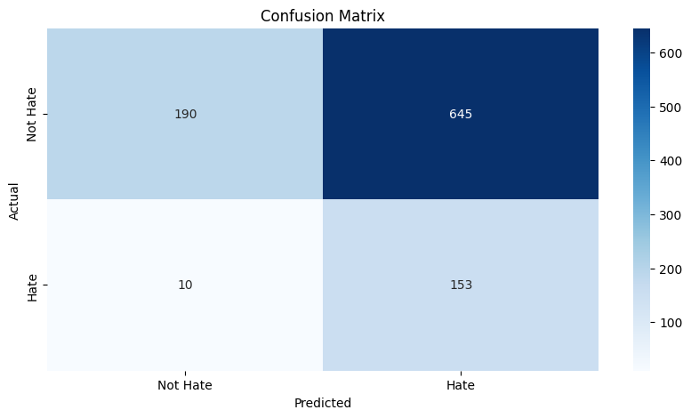

  <b>Left: XGB with all-MiniLM-L6-v2 Sentence Transformers; Right: XGB with hateBERT Sentence Transformers</b>

  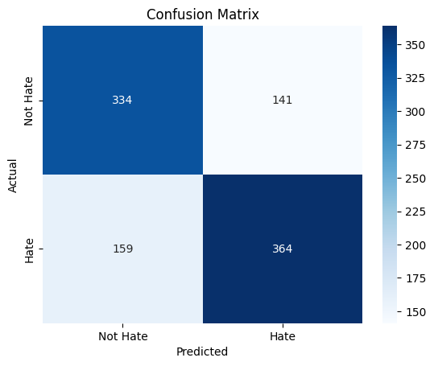
  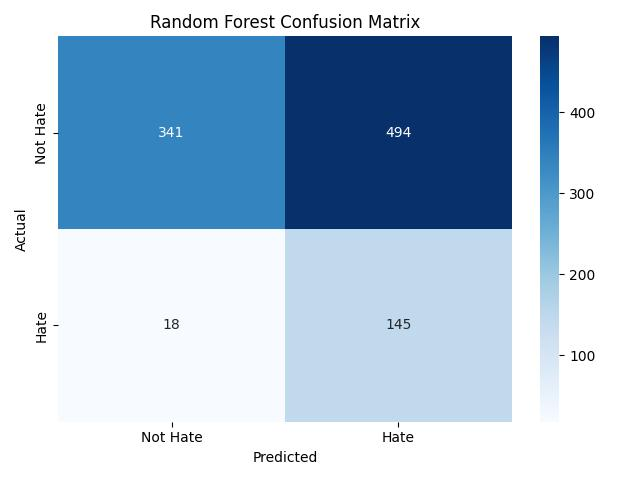

  <b>Left: RF with all-MiniLM-L6-v2 Sentence Transformers; Right: RF with hateBERT Sentence Transformers</b>

  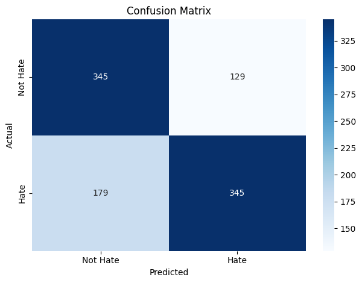
  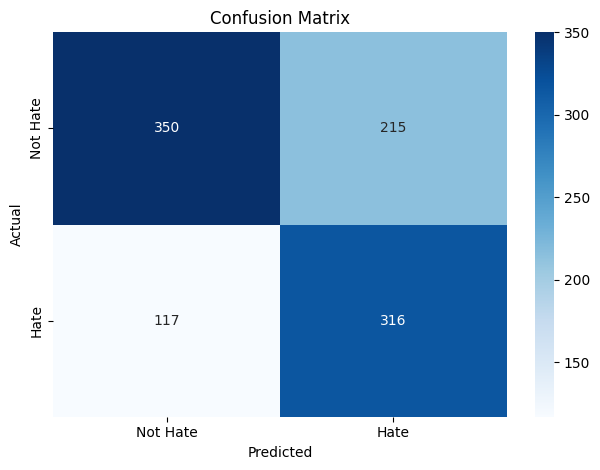

  <b>Left: GNB with all-MiniLM-L6-v2 Sentence Transformers; Right: GNB with hateBERT Sentence Transformers</b>

# Model Selection
Due to its performance on the ROC and Precision-Recall curves for both sentence transformers, the logistic-based models all equally do well. It seems as though adding the penalties does not affect the model's precision or recall.

# Special Case: DistilBERT
We decided to run a sentence transformer without implementing a model to see how well it would run. Unlike hateBERT, DistilBERT (Sanh et.al (2020)) is trained on a generalized language model, so it would have more information to run on. The final ROC curve and confusion matrix is as follows:

  
  

This model exceeds all other models in its AUC, as it is not limited in its vocabulary as hateBERT is.

# Limitations and Extensions
A major limitation for the models is the computation time, as some of these models run for at least 20 minutes to obtain output. In an attempt to speed up runtime, we use methods like `PCA` and
`HalvingGridSearchCV`, so that itself could be driving some of our results.

The confusion matrices we placed above compare the embedding of the hateBERT and $all-MiniLM-L6-v2$ sentence transformers. HateBERT tends to have a higher rate of false positive, where it marks 'Hate' for phrases that are not. This is likely due to hateBERT being trained on a large dataset of extreme hate speech from banned communities in Reddit.

We are also unable to detect any possible hate speech that contains sarcasm, as our models are not specifically trained on that. Furthermore, we are unable to capture the full context of the comment. For example, we may have replies for a certain tweet but may not necessarily have information of the tweet itself so that context is ignored. Similarly, much of the hate speech online nowadays is heavily coded and abstract to the point where the data we tested on would not be able to pick up on the subtleties that could be found.

# Declaration of Work
## Ben
* Built the Gaussian Naive Bayes model, the Gaussian hateBERT model, the DistilBERT model, and the Simple Neural Network model (unused)
* Froze the DistilBERT model to make it accessible for more convenient use with other models
  
## Chris
* Built the Random Forest and hateBERT Random Forest models
* Built the hateBERT Ridge model
  
## Juan
* Obtained training data
* Wrote script for the extraction of data
* Built XGBoost and hateBERT_XGBoost models
  
## Nicolas
* Built the Logistic, Lasso, and Ridge Models
* Found the test data and uploaded to repository
* Created `roc_curves.py` and `pr_curves.py` code

## Vighnesh
* Built the KNN models
* Built the Logistic and Lasso hateBERT models
  
### Citation

Vidgen, B., Thrush, T., Waseem, Z., & Kiela, D. (2021).  
**Learning from the Worst: Dynamically Generated Datasets to Improve Online Hate Detection**.  
*Proceedings of the 59th Annual Meeting of the Association for Computational Linguistics (ACL)*.  
[https://doi.org/10.18653/v1/2021.acl-long.132](https://doi.org/10.18653/v1/2021.acl-long.132)

Sanh, V., Debut, L., Chaumond, J., & Wolf, T. (2020).  
*DistilBERT, a distilled version of BERT: smaller, faster, cheaper and lighter*.  
5th Workshop on Energy Efficient Machine Learning and Cognitive Computing - NeurIPS 2019.  
[https://doi.org/10.48550/arXiv.1910.01108](https://doi.org/10.48550/arXiv.1910.01108)

